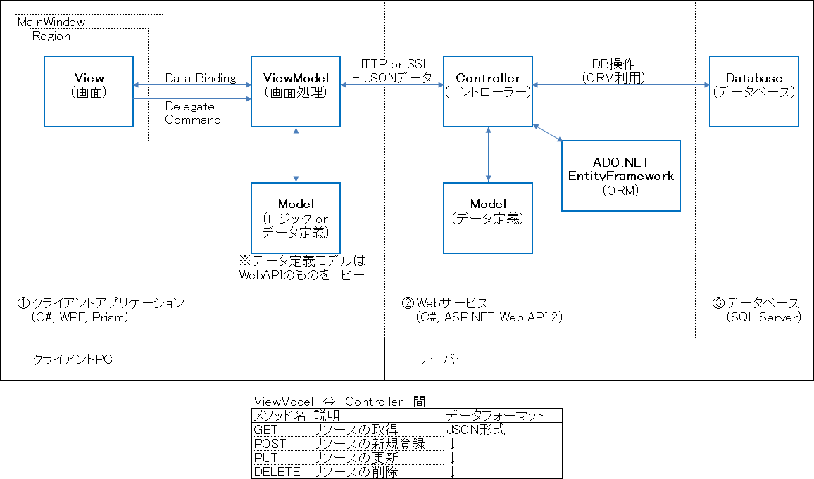
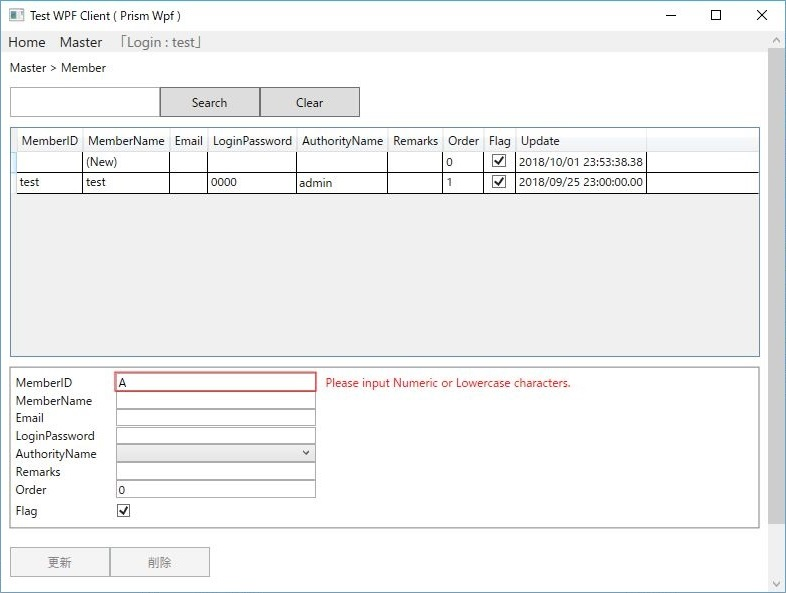

## C# WPF Application(Prism, MVVM pattern) + ASP.NET Web API 2, Sample project.

C# WPFアプリケーション(Prism, MVVM パターン) + ASP.NET Web API 2 のサンプルプロジェクトです。 
 
WPFアプリケーション(Prism MVVM)のViewModelから、HttpClientでHTTP通信(JSON形式のデータ)を利用して、 
ASP.NET Web API 2のコントローラーを実行します。RESTfulなサービスを提供する構成となっています。 
 
 
### 【全体図】

 
 
Visual Studio Express 2012(C#5.0)で実行可能です。 
サンプルプログラム自体は、マスタデータを取得・追加・更新・削除するシンプルな構成となっています。 
実際の業務系システムの開発現場では単純なマスタデータの更新処理だけではありませんが、 
このサンプルプログラムを利用して応用して作成していくことはできると思います。 
 
 
### 【画面イメージ】

 
 
### 【アプリケーション仕様】

①　クライアント 
言語・アプリケーション　：　C#、WPFアプリケーション (Visual Studio Express 2012 for Windows Desktop) 
主要パッケージ　　　　　：　Prism 6 (6.2), Prism 6 for Wpf (6.2), Unity for Prism 6 (6.2), Unity (4.0.1) 
　　　　　　　　　　　　　　CommonServiceLocator (1.3) 
　　　　　　　　　　　　　　Microsoft ASP.NET Web API 2.2 Client Libraries (5.2.6), Json.NET (9.0.1) 
 
②, ③　サーバー 
言語・アプリケーション　：　C#、ASP.NET Web API 2(Visual Studio Express 2012 for Web) 
主要パッケージ　　　　　：　Microsoft ASP.NET Web API 2.2 関係 (5.2.6), Json.NET (9.0.1) 
　　　　　　　　　　　　　　ADO.NET Entity Framework (6.2) 
データベース　　　　　　：　SQL Server Express 2012 
 
それぞれ2012版　に限定しているのは、オフラインインストールできる最新バージョンが2012までのため。 
2013版以降であれば、WPFアプリと同様のXaml形式であるUWPアプリ, Xamarin FormsなどもPrismでそれぞれ準備されているので選択できそうです。 
(Windowsフォームアプリは過去の技術) 
 
 
### 【WPFアプリケーションのPrismで利用している主な機能】

・ViewModelLocator(View-ViewModel関連付け) 
・ViewModel→Viewへのエラー通知機能(BindableBaseを継承したAddBindableBaseに追加) 
・Region + Navigation(画面遷移) 
・Delegate command(デリゲートコマンド) 
・Notification, Confirmation(ダイアログ) 
・PropertyChange(画面へ反映) 
・ViewDiscovery(起動時にログイン画面を表示) 
・BootStrapper 
※サンプルプログラムにはカスタムダイアログ(モーダルウィンドウ)を省略してます。別途追加予定。 
 
サンプルソースのWPFアプリケーションで使用しているPrism Wpfにより、 
Prismを利用したことがない人でも、基本的な利用を始めやすいと思います。 
 
Prism Wpf公式サンプル(英語)　https://github.com/PrismLibrary/Prism-Samples-Wpf 
Prism Wpf公式サンプル日本語説明　https://qiita.com/yuchan01/items/7b43a4cef5a91cf7a476 
 
 
 
### 【ASP.NET Web API 2 with Entity Framework】

Microsoft公式ドキュメント「Entity Framework 6 で Web API 2 を使用」にある、サンプルコードに準じたものです。 
また、認証処理ではForms認証を利用してます。 
 
最初にプロジェクト実行時にMainWindowViewModelで、CookieContainerとHttpClientを準備します。 
WPFアプリケーションのログイン画面でログイン要求して  →　ASP.NET Web API 2のAuthControllerで認証、レスポンスから、ユーザー名と権限IDをWPF側のMainWindowViewModelのプロパティに格納します。 
 
ASP.NET Web API 2で作成したEntityFrameworkで使用するPoco Modelは、WPFアプリケーション側にコピーして使用してます。 
 
 
### 【実行方法】

1、SQL Server Express 2012で好きな名前のデータベースを作成する。 
　　※EntityFrameworkでORMを使用してしますのでデータベース種類は問わないかもしれません。 
  　(Oracle, PostgreSQL, ...) 
 
2、Visual Studio Express 2012 for WebでASP.NET Web API 2のソリューションを起動して、 
　　「プロジェクト　→　プロパティ　→　設定」でDebugConnectionString、ReleaseConnectionStringにデータベース接続方法を設定する。  
  　上記で作成したデータベースへテスト接続OKのこと。 
　　パッケージマネージャのコンソールでEntityFrameworkのマイグレーション有効化、追加、 
　　データベースアップデートを実行してください。 
 
3、SQL Server Management Studioで適当なデータを入力してください。 
　　2つのテーブルがありますので、それぞれ1行追加でOKです。 
　　M_Authorities　→ M‗Members の順に追加します。 
　　※そのうちテストデータを用意するかもしれません。 
 
4、Visual Studio Express 2012 for Web　で開発用サーバーを指定してますので、 
　　そのままプログラムを実行して下さい。 
 
5、Visual Studio Express 2012 for Windows Desktopのソリューションを起動して、 
    MainWindowViewModelに書いてあるlocalhostのポート番号が合っているか確認して下さい。    
　　プログラム実行するとログイン画面が表示されます。 
    
 
 
### 【サンプルプログラムの既存の問題】

・ログインパスワード暗号化とSSL化(HTTPS利用)しておきたい。Expressでは開発用サーバーにSSL使えない？ 
・ログイン要求で入手したMemberName、AuthorityIDの格納場所は、MainWindowViewModelのstaticプロパティで良いのか？ 
・httpサーバーのアドレスを、MainWindowViewModelのコンストラクタ内にベタ書きしてるので設定ファイルに移したほうが良いかな。 
・ASP.NET Web APIにasyncを使っている理由はよくわかってないです。(Microsoft公式ドキュメントのサンプルが使っているから) 
・他にも何か改善点があるかもしれません。 
・テーブルの命名規則の修正が必要 
Flag → IsDeleting、Create → CreatedAt (追加必要)、Update → UpdatedAt 
・AddDbContext.csで、作成日時の更新処理の追加が必要 
・AddDbContext.csで、decimalの小数点第3以下も使えるようにする 
protected override void OnModelCreating(DbModelBuilder modelBuilder) { 
    modelBuilder.Conventions.Remove<DecimalPropertyConvention>(); 
    modelBuilder.Conventions.Add(new DecimalPropertyConvention(18, 4)); 
} 
 
 
※IISに乗せて動作しない時は以下の記事も参考にしてください。 
IIS7.5にASP.NET Web API 2を載せる方法と、HTTP Put, Deleteで失敗するの回避策 
https://qiita.com/yuchan01/items/32dfc83d8b7eab6c5dae 
